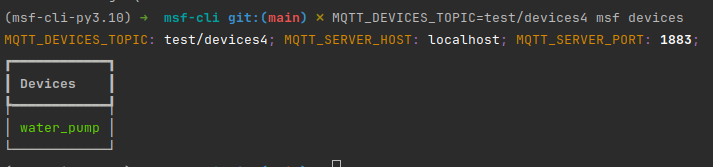

# MSF Cli

For use in creating and managing a project using the micropython-sniffs-framework: https://github.com/surdouski/micropython-sniffs-framework.

## Installation

```bash
pipx install msf-cli
```

## Usage

Note: docker must be installed and on path for broker commands.

### new

```bash
msf new <path>               # creates new msf project at <path>
```

Creates a new project at `<path>`. This is a convenience utility to set up your project so that it's easy to begin
development. However, it does also include some of the things you do require, such as the `.config/mqtt_as.json`
file with some defaults (although at minimum you need to update the "server" value). It also installs the framework and
it's required dependencies.

An example of what the directory looks like after being run:


After updating the json, you can uncomment
out the code in `main.py` related to the device and settings setup to test that everything is working. A simple way to
do this is to navigate to the project path, do `mpbridge dev a0`, wait for everything to load then press `<Enter>` once,
then press `<ctrl+d>` to do a soft restart on the device so that it runs `main.py`.

### broker

```bash
msf broker up --port=1883    # starts a local MQTT broker for testing (--port is optional, default is 1883)
msf broker down              # stops the local MQTT broker
```

#### up

```bash
msf broker up
# output: Local MQTT broker started at 192.168.x.x:1883.
```

This command is meant for testing on your local network. If you already have a broker set up elsewhere that
you want to use, use that instead.

This command runs a `eclipse-mosquitto:1.6` container with some defaults. Can optionally add `--port` to specify
a different port on your local machine you want to access it through.

This command also outputs your IP and port you can connect to it through on your local network.

#### down

```bash
msf broker down
```

Stops and removes the broker.


### devices

All configuration/secrets for can be passed as env vars on the cmdline...

```bash
MQTT_DEVICES_TOPIC=test/devices msf devices <cmd>
```

... or in 2 configuration files, _.config_ and _.secrets_.

_.config_
```
MQTT_DEVICES_TOPIC=topic/path/to/devices
```

_.secrets_
```
MQTT_SERVER_HOST=localhost
MQTT_SERVER_PORT=1883
MQTT_SERVER_USER=myuser  # optional
MQTT_SERVER_PASS=mypass  # optional, but required if user is specified
```

#### list


```bash
# list devices
msf devices
```




#### get device

```bash
# list settings for a device
msf devices <device_id>
```


#### get device setting

```bash
# show a specific setting
msf devices <device_id> <setting_id>
```


#### set device setting

```bash
# update the value of a setting
msf devices <device_id> <setting_id> [--set]/[-s] <value>
```


## Tests (Development)

Will eventually put up a test harness for this and add it to workflows. Today, however, is not that day.